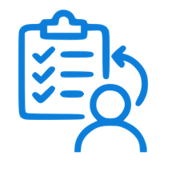

# Tasks by Me

## Overview

Tasks by Me is a web application that allows a Microsoft 365 user to have a unified view of all tasks that they have created or own, and have possibly assigned to other people, in one place.

It integrates with a single Microsoft 365 tenant to provide that tenant's users with this functionality. The application uses Microsoft Graph API to authenticate users and retrieve their task data.

## Installation and integration

Running Tasks by Me requires:

1. An Entra ID app registration in your Microsoft 365 tenant.  
1. Deployment of the Tasks by Me node.js application, configured with parameters from the Entra ID app registration. This can be deployed on any infrastructure, as long as a public URL is available. 
1. The Entra ID app should be updated with the public URL.

We provide tools to help with these steps. Please see the [installation instructions](INSTALL.md).

## Permissions Required

The application requests the following Microsoft Graph permissions from users on first login:
- `User.Read` - Read user profile
- `User.ReadBasic.All` - Read basic profiles of all users
- `Tasks.Read` - Read user's tasks
- `Tasks.Read.Shared` - Read shared tasks

## Prerequisites

- Node.js 22 or higher
- PowerShell 5.1 or PowerShell 7+ (for deployment modules)
- Microsoft 365 tenant with administrator access (for Entra ID app registration)
- (Optional) Azure subscription for web app deloyment

## Support

For issues and questions, please check the repository's issue tracker or consult your Microsoft 365 administrator for tenant-specific configuration questions.
